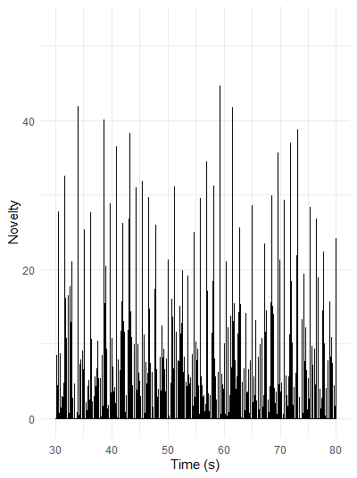
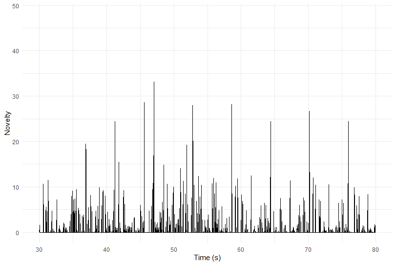
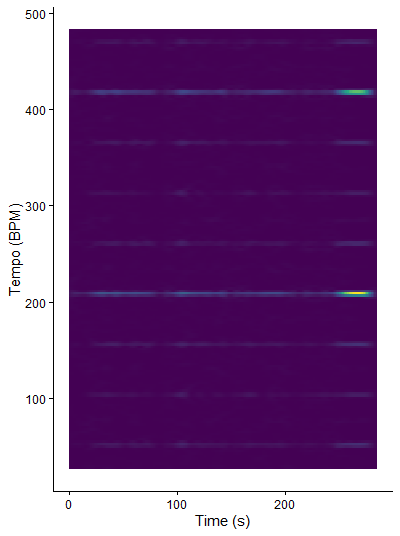
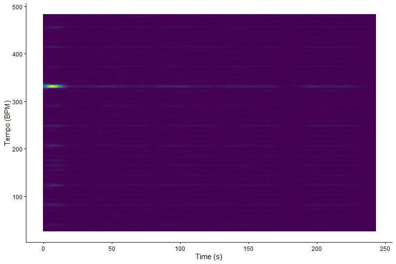

# Key Similarity

## Column {width=60%}

### Row {height=100%}

::: {.panel-tabset }

## The Real Slim Shady

{width=100%}

## So Fresh So Clean

{width=100%}
:::

## Column {width=40%}

### Row {height=100%}

::: {.panel-tabset}

## The real Slim Shady

This keygram shows how similar the chroma features of The Real Slim Shady are to different musical keys over time. The x-axis represents time and the y-axis lists all 24 major and minor keys. Brighter colours indicate a stronger similarity between the chroma vector and a key template. The plot shows frequent vertical stripes and no single row that stays bright for the entire song. This suggests that the track does not remain strongly in one stable key. Instead, the harmonic content is relatively ambiguous, which is typical for loop-based hip-hop production. Because the instrumental relies on repeated samples and limited pitch material, several keys can appear similarly plausible at different moments.

## So fresh So Clean

This keygram also visualizes key similarity over time using chroma features extracted from the audio. As in the previous plot, brighter colours indicate a stronger match with a specific major or minor key template. Compared to The Real Slim Shady, this keygram shows slightly longer regions where the brightness concentrates around certain rows. This indicates a somewhat more stable tonal centre throughout sections of the track. However, there are still visible changes where the brightness shifts to other keys, reflecting harmonic or production changes between sections such as verses or choruses. Overall, the plot suggests that the song maintains clearer tonal areas while still showing some ambiguity typical of hip-hop arrangements.

:::

# Chord Similarity

## Column {width=60%}

### Row {height=100%}

::: {.panel-tabset }

## The Real Slim Shady

{width=100%}

## So Fresh So Clean

{width=100%}
:::

## Column {width=40%}

### Row {height=100%}

::: {.panel-tabset}

## The real Slim Shady

This chord similarity plot shows how closely the chroma features of The Real Slim Shady match different chord templates over time. The x-axis represents time in seconds, while the y-axis lists possible major, minor, and dominant chords. Brighter colours indicate a stronger similarity between the chroma vector and a specific chord template. Similar to the keygram, there is no single chord that stays clearly dominant for long periods. Instead, many chords show moderate similarity at the same time. This reflects the recurring harmonic patterns of the track, where the harmonic content is relatively limited. Because the instrumental uses repeating musical material, the algorithm detects several possible chord matches simultaneously.

## So fresh So Clean

This chord similarity plot also visualizes how well the chroma features match different chord templates throughout the song. The x-axis shows time and the y-axis lists the possible chords. Brighter colours represent a stronger similarity between the chroma features and a chord template. Compared to The Real Slim Shady, the plot shows slightly clearer horizontal patterns where certain chords remain stronger for longer periods. This suggests a somewhat more consistent harmonic structure. However, multiple chords still appear similar at the same time, which is common in hip-hop production where chords may be implied rather than clearly played. The result is a chord estimation with some ambiguity but slightly more stable regions.

:::

# Novelty functions

## Column{width=60%}

### Row {height=100%}

::: {.panel-tabset }

## The Real Slim Shady

{width=100%}

## So Fresh So Clean

{width=100%}
:::

## Column {width=40%}

### Row {height=100%}

::: {.panel-tabset}

## The real Slim Shady

The novelty plot between 30 and 80 seconds shows very dense and frequent peaks, with many values reaching high novelty levels. This indicates that there are many rhythmic onsets occurring in a short amount of time. Such a pattern is typical for hip-hop production, where hi-hats, snares, and kick drums occur rapidly and create a rhythmically active texture. The peaks are distributed quite evenly across the time axis, which suggests that the rhythmic structure of the track is stable and consistent.

Several peaks reach very high values (above 40), which likely correspond to strong drum hits or accented musical events, such as snare hits or moments where the vocal delivery becomes more prominent. Because these peaks appear regularly, they support the idea discussed in Chapter 6 that beat positions often coincide with strong onset events in the music.

Musically, this pattern reflects the tight and repetitive groove typical of rap production. The high density of peaks suggests that many small percussive elements—such as hi-hats, additional percussion, and vocal accents—are layered together. As a result, the novelty curve reveals strong rhythmic regularity, a high onset density, and clearly defined beat-aligned events.

## So fresh So Clean

The novelty plot for So Fresh, So Clean appears much sparser than the previous example, showing fewer peaks and generally lower novelty values over time. This indicates that strong onset events occur less frequently in the track. Most values remain relatively low, with only occasional higher spikes that stand out from the rest of the curve. These isolated peaks likely correspond to stronger musical events such as drum hits or structural accents in the arrangement.

The larger gaps between peaks suggest that rhythmic accents are spaced further apart. As a result, the rhythmic texture appears smoother and less dense. Compared to The Real Slim Shady, the track contains fewer rapid percussive events and allows more space between rhythmic elements. This spacing creates a more relaxed and spacious groove.

Musically, this reflects the laid-back style typical of the track. The lower onset density indicates that fewer percussive elements are layered at the same time, which contributes to a clearer and more open rhythmic structure. Overall, the novelty curve suggests a groove that relies on occasional strong accents rather than constant rhythmic activity, resulting in a smoother and more relaxed rhythmic feel.

## Comparison of the two tracks

The difference between the two novelty curves highlights the contrast in their rhythmic styles. The Real Slim Shady shows a very high density of peaks, indicating frequent onset events and a rhythmically busy texture. The peaks occur regularly and close together, suggesting a tight and consistent beat structure with many layered percussive elements such as hi-hats, kicks, and snares.

In contrast, So Fresh, So Clean displays a much lower peak density. The peaks appear more spaced out and generally reach lower values, which points to a more relaxed rhythmic activity. This creates a smoother groove with fewer percussive layers and more space between musical events.

From a beat tracking perspective, the novelty curve of The Real Slim Shady provides many potential onset candidates due to its dense rhythmic activity. So Fresh, So Clean, on the other hand, offers fewer but clearer rhythmic accents, which reflect its more laid-back and spacious groove.

:::

# Tempograms

## Column{width=60%}

### Row {height=100%}

::: {.panel-tabset }

## The Real Slim Shady

{width=100%}

## So Fresh So Clean

{width=100%}
:::

## Column {width=40%}

### Row {height=100%}

::: {.panel-tabset}

## The real Slim Shady

The DFT tempogram of The Real Slim Shady shows a clear horizontal band around ~210 BPM that remains visible across most of the time axis. In a DFT tempogram, bright horizontal lines indicate tempos that strongly match periodic patterns in the novelty function. According to Chapter 6, this means that the novelty curve contains regular repeating onset patterns at that tempo.

The stability of this band suggests that the song maintains a consistent rhythmic pulse throughout the track. In hip-hop, this higher tempo band often corresponds to subdivisions of the main beat (for example eighth or sixteenth-note pulses), which explains why the dominant tempo appears higher than the perceived beat. Additional weaker bands at higher tempo ranges likely represent harmonics of the rhythmic periodicity.

Overall, the tempogram indicates a stable and clearly defined tempo, reflecting the tight and repetitive rhythmic structure typical of rap production.

## So fresh So Clean
The DFT tempogram for So Fresh, So Clean looks more diffuse and less intense, with fewer strong horizontal bands. The most noticeable energy appears around ~330 BPM, but it is concentrated only at the beginning of the excerpt and fades afterwards.

Compared to The Real Slim Shady, the tempo representation is less stable and less pronounced over time. This suggests that the novelty function contains weaker periodic patterns, which results from fewer and more spaced onset events. According to the book, strong and consistent peaks in a novelty function typically produce clearer tempo bands in the tempogram.

Because the rhythmic activity in this track is more relaxed and sparse, the periodic structure is less dominant in the analysis. As a result, the tempogram shows weaker tempo evidence and fewer persistent tempo bands, reflecting the smoother and more laid-back groove of the track.

:::
