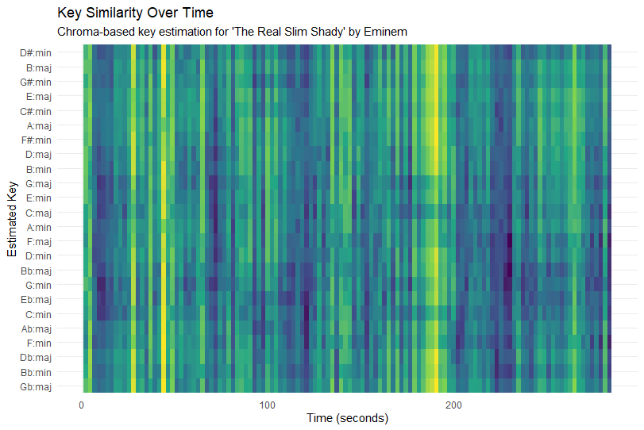
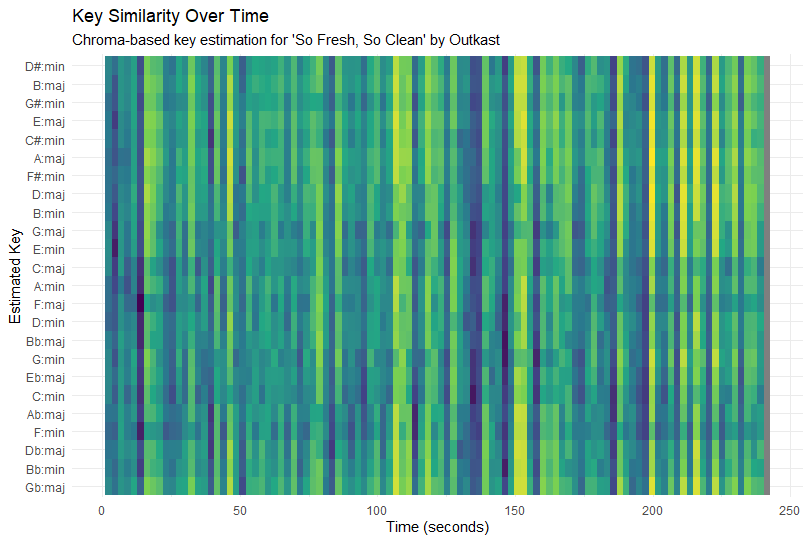

# Computational Musicology Bardha Berisha

## Column {width=60%}

### Row {height=100%}

::: {.panel-tabset }

## The Real Slim Shady

{width=100%}

## So Fresh So Clean

{width=100%}
:::

## Column {width=40%}

### Row {height=100%}

::: {.panel-tabset}

## The real Slim Shady

This keygram shows how similar the chroma features of The Real Slim Shady are to different musical keys over time. The x-axis represents time and the y-axis lists all 24 major and minor keys. Brighter colours indicate a stronger similarity between the chroma vector and a key template. The plot shows frequent vertical stripes and no single row that stays bright for the entire song. This suggests that the track does not remain strongly in one stable key. Instead, the harmonic content is relatively ambiguous, which is typical for loop-based hip-hop production. Because the instrumental relies on repeated samples and limited pitch material, several keys can appear similarly plausible at different moments.

## So fresh So Clean

This keygram also visualizes key similarity over time using chroma features extracted from the audio. As in the previous plot, brighter colours indicate a stronger match with a specific major or minor key template. Compared to The Real Slim Shady, this keygram shows slightly longer regions where the brightness concentrates around certain rows. This indicates a somewhat more stable tonal centre throughout sections of the track. However, there are still visible changes where the brightness shifts to other keys, reflecting harmonic or production changes between sections such as verses or choruses. Overall, the plot suggests that the song maintains clearer tonal areas while still showing some ambiguity typical of hip-hop arrangements.

:::

