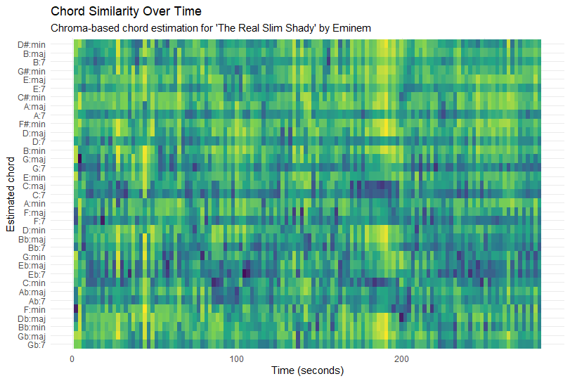
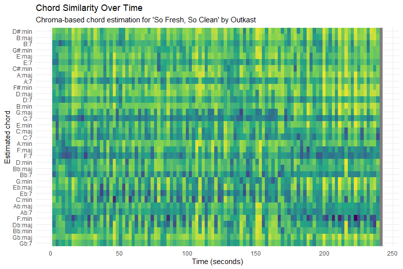

# Key Similarity

## Column {width=60%}

### Row {height=100%}

::: {.panel-tabset }

## The Real Slim Shady

{width=100%}

## So Fresh So Clean

{width=100%}
:::

## Column {width=40%}

### Row {height=100%}

::: {.panel-tabset}

## The real Slim Shady

This keygram shows how similar the chroma features of The Real Slim Shady are to different musical keys over time. The x-axis represents time and the y-axis lists all 24 major and minor keys. Brighter colours indicate a stronger similarity between the chroma vector and a key template. The plot shows frequent vertical stripes and no single row that stays bright for the entire song. This suggests that the track does not remain strongly in one stable key. Instead, the harmonic content is relatively ambiguous, which is typical for loop-based hip-hop production. Because the instrumental relies on repeated samples and limited pitch material, several keys can appear similarly plausible at different moments.

## So fresh So Clean

This keygram also visualizes key similarity over time using chroma features extracted from the audio. As in the previous plot, brighter colours indicate a stronger match with a specific major or minor key template. Compared to The Real Slim Shady, this keygram shows slightly longer regions where the brightness concentrates around certain rows. This indicates a somewhat more stable tonal centre throughout sections of the track. However, there are still visible changes where the brightness shifts to other keys, reflecting harmonic or production changes between sections such as verses or choruses. Overall, the plot suggests that the song maintains clearer tonal areas while still showing some ambiguity typical of hip-hop arrangements.

:::

# Chord Similarity

## Column {width=60%}

### Row {height=100%}

::: {.panel-tabset }

## The Real Slim Shady

{width=100%}

## So Fresh So Clean

{width=100%}
:::

## Column {width=40%}

### Row {height=100%}

::: {.panel-tabset}

## The real Slim Shady

This chord similarity plot shows how closely the chroma features of The Real Slim Shady match different chord templates over time. The x-axis represents time in seconds, while the y-axis lists possible major, minor, and dominant chords. Brighter colours indicate a stronger similarity between the chroma vector and a specific chord template. Similar to the keygram, there is no single chord that stays clearly dominant for long periods. Instead, many chords show moderate similarity at the same time. This reflects the recurring harmonic patterns of the track, where the harmonic content is relatively limited. Because the instrumental uses repeating musical material, the algorithm detects several possible chord matches simultaneously.

## So fresh So Clean

This chord similarity plot also visualizes how well the chroma features match different chord templates throughout the song. The x-axis shows time and the y-axis lists the possible chords. Brighter colours represent a stronger similarity between the chroma features and a chord template. Compared to The Real Slim Shady, the plot shows slightly clearer horizontal patterns where certain chords remain stronger for longer periods. This suggests a somewhat more consistent harmonic structure. However, multiple chords still appear similar at the same time, which is common in hip-hop production where chords may be implied rather than clearly played. The result is a chord estimation with some ambiguity but slightly more stable regions.

:::

