# Home

## Column {width=60%}

### Row {height=100%}
::: {.panel-tabset }
## Introduction 

For this project, I will analyse a corpus of 300 hip-hop tracks from three different decades: the 1990s, 2000s, and 2010s. Each decade contains 100 top tracks sourced from Spotify, which makes it possible to compare how the style of hip-hop has changed over time. By grouping the songs in this way, I want to explore differences in features such as energy, danceability, valence, tempo, and loudness.

The main question I am interested in is how the overall sound of mainstream hip-hop has evolved across these decades, and how well Spotify’s audio features can capture these changes. In addition to the larger dataset, I will select two songs from each decade for a more detailed analysis. For the 1990s, I will analyse N.Y. State of Mind by Nas and Nuthin’ but a 'G' Thang by Dr. Dre. For the 2000s, I will focus on The Real Slim Shady by Eminem and So Fresh, So Clean by OutKast. For the 2010s, I will analyse HUMBLE. by Kendrick Lamar and Hotline Bling by Drake. These tracks were chosen because they highlight clear stylistic differences within each decade, which will help to better understand how hip-hop has evolved in terms of rhythm, timbre, and overall sound.
:::

## Column {width=60%}

### Row {height=100%}
::: {.panel-tabset }

## 90's Playlist 

<iframe data-testid="embed-iframe" style="border-radius:12px" src="https://open.spotify.com/embed/playlist/5MGgJXpDpU5cVyUxYv7CEg?utm_source=generator&theme=0" width="100%" height="800" frameBorder="0" allowfullscreen="" allow="autoplay; clipboard-write; encrypted-media; fullscreen; picture-in-picture" loading="lazy"></iframe>

## 00's Playlist 

<iframe data-testid="embed-iframe" style="border-radius:12px" src="https://open.spotify.com/embed/playlist/7t4eIBdcmVo2nN879i2lex?utm_source=generator&theme=0" width="100%" height="800" frameBorder="0" allowfullscreen="" allow="autoplay; clipboard-write; encrypted-media; fullscreen; picture-in-picture" loading="lazy"></iframe>

## 10's Playlist

<iframe data-testid="embed-iframe" style="border-radius:12px" src="https://open.spotify.com/embed/playlist/1B5Ip9pxQgod4z3dQHZAWR?utm_source=generator&theme=0" width="100%" height="800" frameBorder="0" allowfullscreen="" allow="autoplay; clipboard-write; encrypted-media; fullscreen; picture-in-picture" loading="lazy"></iframe>

:::
# Track-Level Features

## Column {width=60%}

### Row {height=100%}
::: {.card}

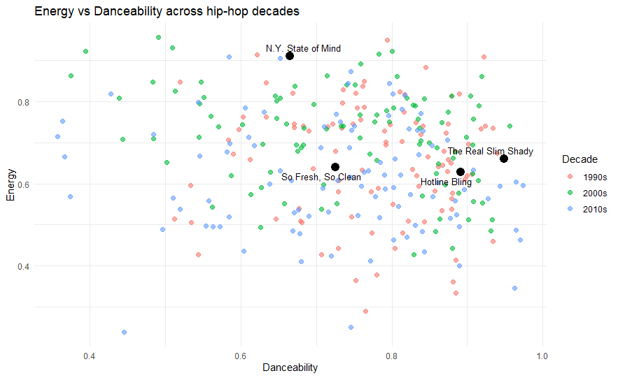{width=100%}
*Figure 1: Energy vs Danceability across decades. Highlighted tracks show stylistic contrast.*

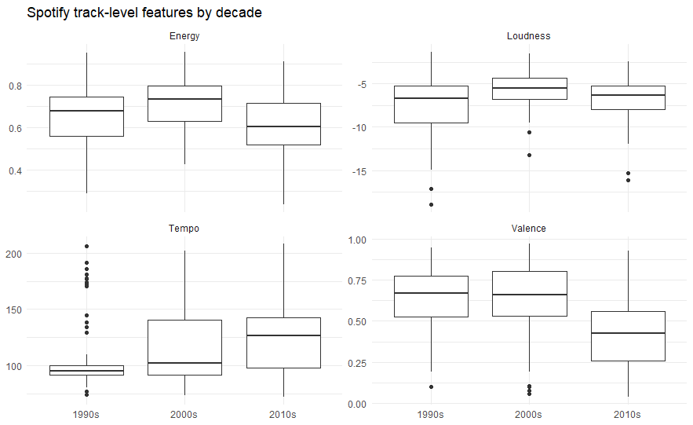{width=100%}
*Figure 2: Distribution of Spotify features per decade.*

:::

## Column {width=40%}

### Row {height=100%}
::: {.panel-tabset }
## Introduction 

These visualisations show the track-level Spotify features of my corpus, consisting of 300 hip-hop songs divided into three decades: the 1990s, 2000s, and 2010s. The scatterplot of energy versus danceability already reveals some clear patterns. Songs from the 2010s tend to cluster more tightly around higher danceability values, suggesting a more consistent, groove-oriented production style. In contrast, the 1990s tracks are more spread out, reflecting a wider variation in style and production techniques. The highlighted songs support this: N.Y. State of Mind sits higher in energy but lower in danceability, while Hotline Bling shows the opposite trend with smoother, more danceable characteristics.

The boxplots further reinforce these observations. Energy appears to peak in the 2000s, while the 2010s show slightly lower but more consistent values. Loudness increases over time, which aligns with the idea of the “loudness war” discussed in the course material. Tempo also becomes more varied in later decades, while valence decreases in the 2010s, suggesting a shift towards darker or more introspective moods.
:::

# Chroma Features

## Column {width=60%}

### Row {height=80%}
::: {.panel-tabset }
## Chromagram of N.Y. State of Mind.

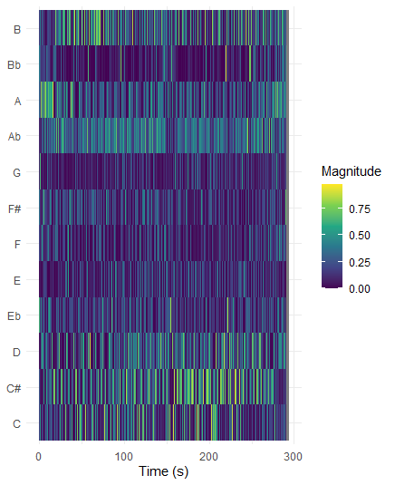{width=100%}

## Chromagram of HUMBLE.

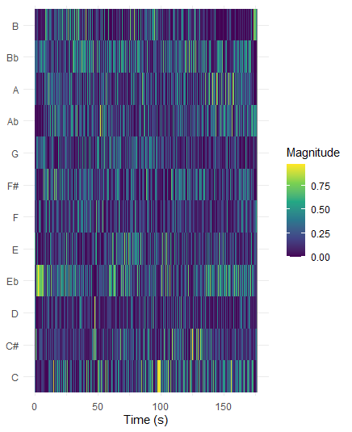{width=100%}

:::

## Column {width=40%}

### Row {height=100%}

These chromagrams show the distribution of pitch classes over time for N.Y. State of Mind and HUMBLE., providing insight into the harmonic content of both tracks. In N.Y. State of Mind, the chromagram appears relatively stable, with certain pitch classes such as C, Eb, and Bb recurring consistently throughout the track. This pattern suggests a loop-based structure. When listening to the song, this is also perceptible: around 25 seconds into the track, right after the intro, a repeating musical loop becomes apparent and continues quite consistently until the outro at approximately 4:36. The visualisation seems to reflect this repetition.

In contrast, the chromagram of HUMBLE. appears more irregular, with pitch class activity that is less consistent over time. From a listening perspective, there does not seem to be a clearly repeating harmonic pattern in the same way as in N.Y. State of Mind, which may explain the less structured appearance of the chromagram.

Overall, this comparison indicates that the 1990s track exhibits a more clearly repeated harmonic structure, while the 2010s track appears more variable and less consistent in its pitch content, based on both the visualisation and listening observations.

# Timbre Features

## Column {width=60%}

### Row {height=100%}

::: {.panel-tabset}
## HUMBLE. – Cepstrogram
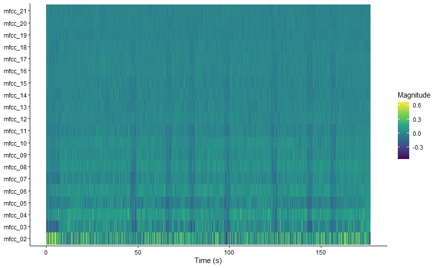{width=100%}

*Shows more abrupt timbral changes and short drop-outs.*

## Nuthin’ but a ‘G’ Thang – Cepstrogram
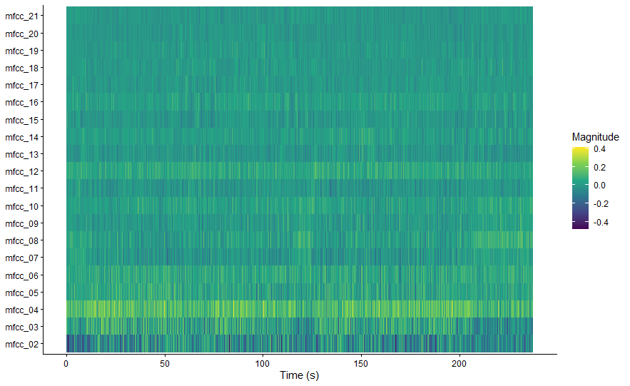{width=100%}

*Shows a more stable and consistent timbral structure over time.*

:::

## Column {width=40%}

### Row {height=100%}

::: {.panel-tabset }
## Humble by Kendrick
The cepstrogram of humle shows how the timbral characteristics of the track change over time through the MFCC components. Most of the higher-order coefficients (e.g., mfcc_10 and above) remain relatively stable, while the lower-order coefficients, especially mfcc_02 to mfcc_05, show more noticeable variation. These lower coefficients are generally associated with broader aspects of the sound, such as overall spectral shape or brightness.

In the visualisation, there are several moments where these lower MFCCs change more abruptly, which suggests shifts in the timbral texture of the track. When listening alongside the cepstrogram, these changes seem to coincide with moments where the background is suddenly removed for a short duration (around two seconds). These brief drop-outs create a noticeable contrast in the sound, which is reflected as sharp changes in the cepstrogram.

At the same time, much of the cepstrogram remains relatively consistent, indicating a stable underlying production style. Overall, the cepstrogram highlights how short structural changes, such as brief pauses or drop-outs, can have a clear impact on the perceived timbre of the track.

## Nuthin’ but a ‘G’ Thang by Dr. Dre
The cepstrogram of Nuthin’ but a ‘G’ Thang shows a relatively stable timbral structure over time, with most MFCC components remaining consistent throughout the track. Similar to the previous example, the higher-order coefficients (mfcc_10 and above) show little variation, while the lower-order coefficients, particularly mfcc_02 to mfcc_05, display more noticeable changes. These lower components are typically related to broader aspects of the sound, such as overall spectral shape and warmth.

Compared to more modern productions, the changes in the cepstrogram appear more gradual and less abrupt. There are fewer sharp transitions, which suggests that the track maintains a steady sonic texture. When listening to the song, this aligns with a smooth, funk-influenced hip-hop style built around a consistent groove and repeating musical elements, where layers evolve gradually rather than changing suddenly.

Some variation can still be observed in the lower MFCCs, which may correspond to subtle changes in instrumentation, such as the introduction of additional melodic elements or shifts in emphasis within the groove. However, these changes do not disrupt the overall consistency of the track.

Overall, the cepstrogram reflects a stable and cohesive timbral profile, supporting the idea that this track relies on a continuous groove and gradual variation rather than abrupt structural changes.
:::

# Chord Similarity

## Column {width=60%}

### Row {height=100%}

::: {.panel-tabset}
## So Fresh, So Clean
{width=100%}
*Clear repeating chord loop centred around C minor.*

## The Real Slim Shady
{width=100%}
*More dynamic pattern with frequent chord transitions.*

## HUMBLE.
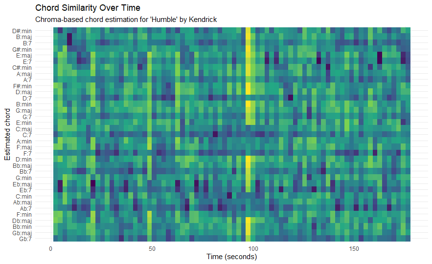{width=100%}
*Fragmented structure with less continuous harmonic patterns.*

## Hotline Bling
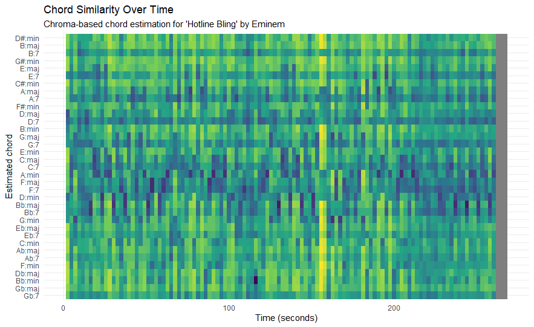{width=100%}
*Smooth, repeating chord cycle with consistent structure.*

:::

## Column {width=40%}

### Row {height=100%}

::: {.panel-tabset}

## So fresh So Clean

This chordogram shows the estimated chord activity over time for So Fresh, So Clean by OutKast. The visualisation shows a relatively stable pattern, with a limited number of chords appearing consistently throughout the track. Rather than frequent harmonic changes, the same chords seem to return in a repeating structure.

This is visible through the horizontal bands that persist over time, as well as the repeating vertical patterns, which suggest a loop-based harmonic progression. Most of the activity appears concentrated around chords related to C minor, which suggests that the song is largely centred in this key. This can be seen in the consistent presence of chords such as C:min and closely related chords, which remain visible across large parts of the time axis.

There are some variations in intensity, where certain chords become more prominent at different moments. These changes likely reflect shifts in arrangement or emphasis, rather than entirely new harmonic material.

When listening to the track, this repetition is also clearly noticeable and contributes to the relaxed and groove-oriented character of the song.

## The real Slim Shady

This chordogram shows the estimated chord activity over time for The Real Slim Shady by Eminem. Compared to So Fresh, So Clean, the visual pattern appears less stable and more fragmented, with more variation in both horizontal and vertical directions.

There are still repeating patterns visible, suggesting that the track is also built around a loop-based harmonic structure with a limited number of chords. However, these patterns appear less continuous and more interrupted. The chord estimation indicates that the song relies on a small set of chords that return regularly, but with more noticeable transitions between them.

These transitions are visible as shifts in intensity between different chord rows, rather than one dominant chord remaining constant over long periods. This creates a more dynamic visual pattern, where chords alternate more frequently compared to the smoother structure seen in So Fresh, So Clean.

When listening to the track, this aligns with a more active and rhythmically driven structure, where changes in sections and emphasis occur more often. The chordogram reflects this by showing more variation in chord presence and clearer transitions between harmonic regions.

## HUMBLE. 

This chordogram shows the estimated chord activity over time for HUMBLE. by Kendrick Lamar. A good starting point is that the song mainly uses a small number of chords, with E♭ minor being the main one. This means the song stays around the same tonal centre instead of constantly changing.

In the visualisation, this can be seen by the fact that only a few rows show stronger activity, and these return multiple times throughout the track. However, unlike some of the other songs, the pattern is not very smooth or clearly repeating. Instead, it looks more scattered, with short moments where certain chords become stronger and then disappear again.

These short bursts suggest that the song does not follow a long, continuous chord loop, but rather uses brief changes and then returns to the same main chord area. Compared to tracks like So Fresh, So Clean, the harmonic structure here feels less stable and more broken up.

Overall, the chordogram suggests that HUMBLE. uses a small set of chords and focuses less on harmony, with more emphasis on rhythm and overall sound.

## Hotline Bling
This chordogram shows the estimated chord activity over time for Hotline Bling by Drake. A good starting point is that the song mainly uses a small number of chords, around four, and is centred around B♭. This means the song does not change chords a lot, but instead repeats a similar pattern.

In the visualisation, this can be seen because only a few rows show stronger activity, and these keep coming back throughout the track. You do not see many completely new chords appearing, but rather the same ones repeating over time. This makes the overall pattern look quite consistent.

The changes between chords are also not very abrupt. Instead, they happen in short, repeating cycles, which suggests that the song is built around a loop. Compared to some other tracks, the pattern looks smoother and less fragmented.

When listening to the song, this repetition is also noticeable and gives it a relaxed and steady feel. Overall, the chordogram suggests that Hotline Bling relies on a small set of repeating chords, which creates a consistent and predictable harmonic structure.

:::

# Tempograms

## Column {width=60%}

### Row {height=100%}

::: {.panel-tabset}

## The Real Slim Shady
{width=100%}
*Strong and stable tempo band (~210 BPM), reflecting dense rhythmic structure.*

## So Fresh, So Clean
{width=100%}
*Weaker and less stable tempo representation, reflecting a smoother groove.*

## Hotline Bling
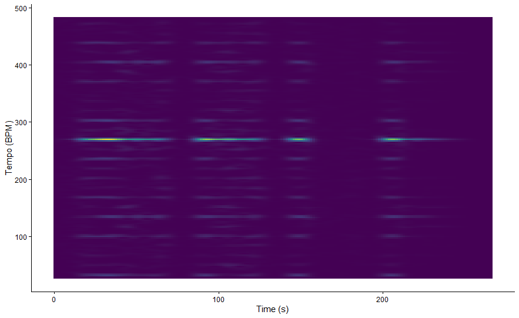{width=100%}
*Stable tempo band (~270 BPM), likely a subdivision of the beat.*

## Nuthin’ but a ‘G’ Thang
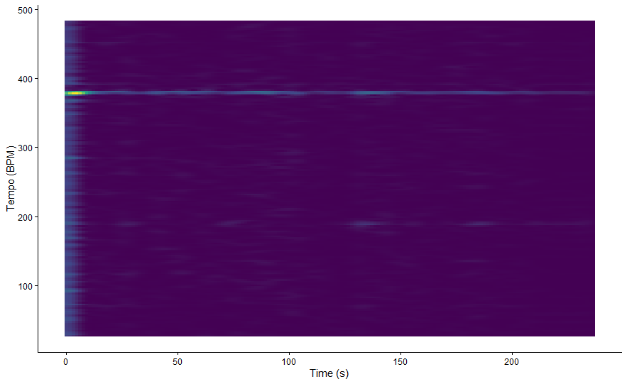{width=100%}
*Very stable high-tempo band (~380 BPM), indicating strong subdivisions.*

:::

## Column {width=40%}

### Row {height=100%}

::: {.panel-tabset}

## The real Slim Shady

The DFT tempogram of The Real Slim Shady by Eminem shows a clear horizontal band around ~210 BPM that remains visible across most of the time axis. In a DFT tempogram, bright horizontal lines indicate tempos that strongly match periodic patterns in the novelty function, meaning that there are regular repeating onset patterns at that tempo.

However, this strongest band is likely not the perceived main beat, but rather a higher harmonic of it. This means that the actual tempo listeners perceive is probably lower, while the tempogram emphasises faster subdivisions of the beat, such as eighth or sixteenth notes. This explains why the dominant tempo appears relatively high compared to what we might tap along to.

The stability of this band still suggests that the song maintains a consistent rhythmic pulse throughout the track. Additional weaker bands at higher tempo ranges likely represent further harmonics of this rhythmic structure.

Overall, the tempogram indicates a stable and clearly defined rhythmic pattern, where the strongest energy reflects subdivisions of the beat rather than the main pulse itself.

## So fresh So Clean
The DFT tempogram of So Fresh, So Clean shows a much less dense and less stable rhythmic picture than The Real Slim Shady. Instead of one strong horizontal band remaining visible across most of the track, the clearest energy appears around ~330 BPM mainly at the very beginning, after which it becomes much weaker. This suggests that the strongest periodic pattern is short-lived rather than sustained throughout the full song.

What stands out here is not just that the tempogram is weaker, but that it reflects the overall feel of the track. So Fresh, So Clean has a smoother and more spacious groove, with fewer sharp onset events and more room between accents. Because a DFT tempogram depends on regular repeating peaks in the novelty function, this more relaxed rhythmic structure produces less continuous tempo evidence.

The strongest tempo activity also appears at a relatively high BPM, which is likely a subdivision of the beat rather than the main pulse listeners would hear directly. After the opening, the lack of strong persistent bands suggests that the rhythmic pattern stays laid-back and does not push a tightly articulated pulse.

Overall, the tempogram reflects a track with a more subtle, groove-based rhythmic organisation, where the beat is present but less aggressively outlined.

## Hotline Bling

The DFT tempogram of Hotline Bling shows a relatively clear and stable horizontal band around ~270 BPM that remains visible for most of the track. According to Chapter 6, strong horizontal lines in a tempogram indicate that the novelty function contains regular repeating onset patterns at that tempo.

Similar to the other examples, this strongest band is likely not the main beat that listeners would perceive directly, but rather a higher subdivision or harmonic of the beat. This explains why the tempo appears relatively high. The actual perceived tempo is likely lower, while the tempogram highlights faster repeating rhythmic elements.

Compared to The Real Slim Shady, the pattern here is slightly less intense but still quite consistent over time. There are fewer abrupt changes, and the main tempo band remains stable throughout most of the track. This suggests that the rhythmic structure is steady and loop-based.

At the same time, the overall texture of the tempogram is smoother, with fewer strong additional bands. This reflects the more controlled and minimal rhythmic style of the track, where the groove is consistent but not overly dense.

Overall, the tempogram indicates a stable rhythmic structure with clear periodic patterns, mainly driven by subdivisions of the beat rather than a strongly accented main pulse.

## Nothin' but a 'G' Thang

The DFT tempogram of Nuthin’ but a ‘G’ Thang shows a clear horizontal band around ~380 BPM that remains visible across most of the time axis. In a DFT tempogram, bright horizontal lines indicate tempos that strongly match periodic patterns in the novelty function, meaning that there are regular repeating onset patterns at that tempo.

However, this strongest band is likely not the perceived main beat, but rather a higher harmonic of it. This means that the actual tempo listeners perceive is probably lower, while the tempogram highlights faster subdivisions of the beat. This explains why the dominant tempo appears relatively high compared to what we might tap along to.

The stability of this band suggests that the song maintains a consistent rhythmic pulse throughout the track. Compared to other tracks, the tempogram appears relatively clean, with fewer additional strong bands, indicating less competing rhythmic activity.

Overall, the tempogram indicates a stable and steady rhythmic structure, where the strongest energy reflects subdivisions of the beat rather than the main pulse itself.
:::

# Random Forest

## Column{width=60%}

### Row {height=100%}

::: {.card}

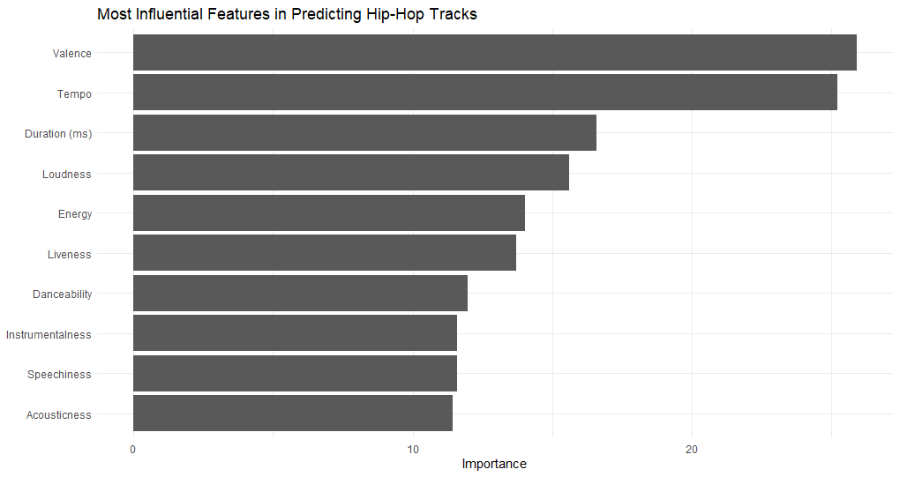{width=100%}

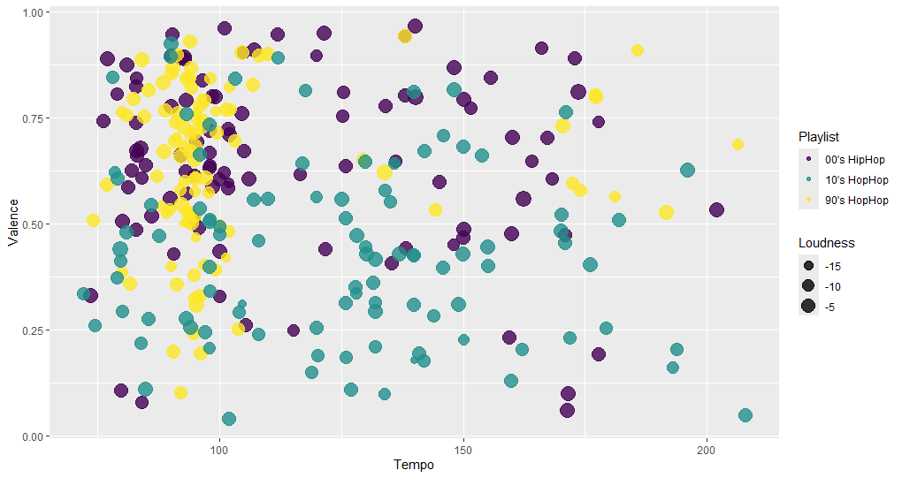{width=100%}
:::

## Column{width=40%}

### Row {height=100%}

The random forest suggests that the three hip-hop decade playlists can be separated to some extent using Spotify track-level features, although the scatterplot also shows that there is still quite a lot of overlap between groups. In the Tempo–Valence plot, the 2010s tracks appear more spread out at higher tempo values, while the 1990s and 2000s cluster more strongly around lower tempos. At the same time, valence varies a lot within each decade, which suggests that mood alone is not enough to clearly separate the playlists.

The feature-importance plot helps explain this. Valence and tempo are the two most influential features in the model, meaning they contribute the most to distinguishing tracks by decade. Duration and loudness also seem important, which suggests that both song structure and production style matter in the classification. By contrast, acousticness, speechiness, and instrumentalness contribute much less, so they seem less useful for separating the decades in this corpus.

Overall, the model suggests that decade differences are present, but not perfectly distinct.

# conclusion
## Column{width=60%}

### Row {height=100%}
This analysis set out to explore how the sound of mainstream hip-hop has evolved across the 1990s, 2000s, and 2010s using Spotify audio features and more detailed audio-based analyses. Overall, the results suggest that there are clear differences between decades, but also a strong underlying continuity in how hip-hop is structured.

At the track level, features such as tempo, valence, and loudness show noticeable shifts over time, with later decades generally appearing more standardised and, in some cases, louder and more rhythmically consistent. The classification results support this, showing that some features—especially valence and tempo—are useful for distinguishing between decades, although the overlap between groups indicates that these differences are not absolute.

The more detailed analyses provide additional insight. Chromagrams and chordograms show that hip-hop across all decades often relies on loop-based harmonic structures, although newer tracks tend to appear more minimal and less harmonically stable. Tempograms and cepstrograms further highlight differences in rhythmic density and timbral variation, with older tracks often showing smoother, more continuous patterns and newer tracks emphasising contrast and minimalism.

Overall, Spotify features capture broad stylistic trends, but combining them with audio-based analyses gives a more complete understanding of how hip-hop has evolved.

## Column {width=40%}

### Row {height=100%}
::: {.panel-tabset }

## 90's Playlist 

<iframe data-testid="embed-iframe" style="border-radius:12px" src="https://open.spotify.com/embed/playlist/5MGgJXpDpU5cVyUxYv7CEg?utm_source=generator&theme=0" width="100%" height="800" frameBorder="0" allowfullscreen="" allow="autoplay; clipboard-write; encrypted-media; fullscreen; picture-in-picture" loading="lazy"></iframe>

## 00's Playlist 

<iframe data-testid="embed-iframe" style="border-radius:12px" src="https://open.spotify.com/embed/playlist/7t4eIBdcmVo2nN879i2lex?utm_source=generator&theme=0" width="100%" height="800" frameBorder="0" allowfullscreen="" allow="autoplay; clipboard-write; encrypted-media; fullscreen; picture-in-picture" loading="lazy"></iframe>

## 10's Playlist

<iframe data-testid="embed-iframe" style="border-radius:12px" src="https://open.spotify.com/embed/playlist/1B5Ip9pxQgod4z3dQHZAWR?utm_source=generator&theme=0" width="100%" height="800" frameBorder="0" allowfullscreen="" allow="autoplay; clipboard-write; encrypted-media; fullscreen; picture-in-picture" loading="lazy"></iframe>

:::

